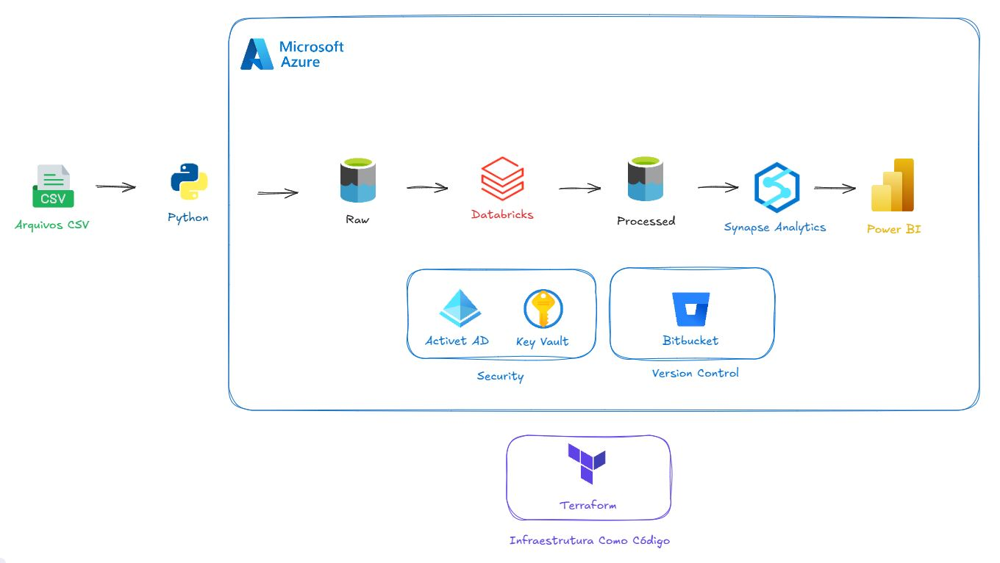
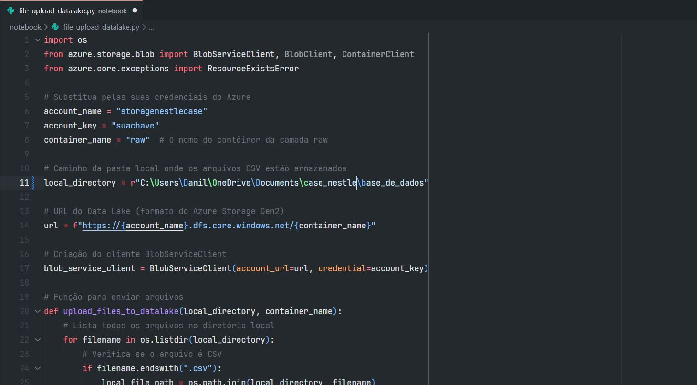
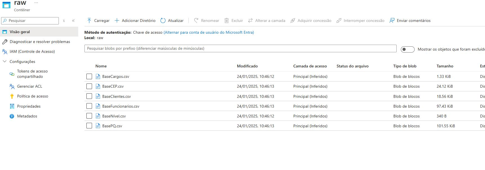
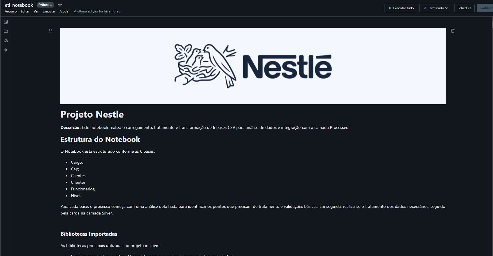
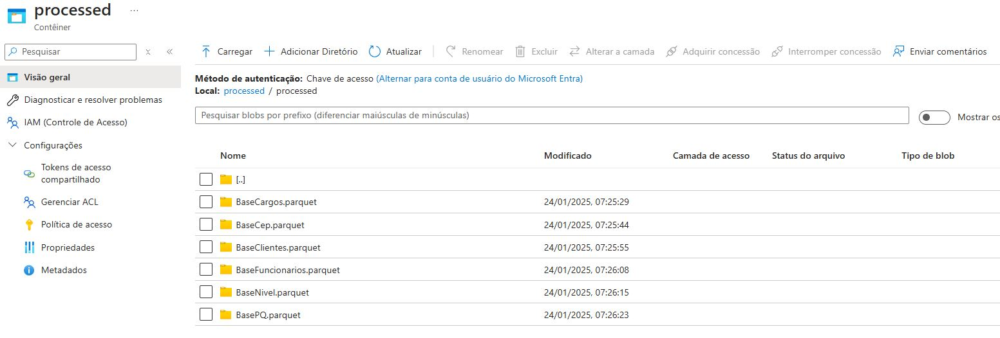
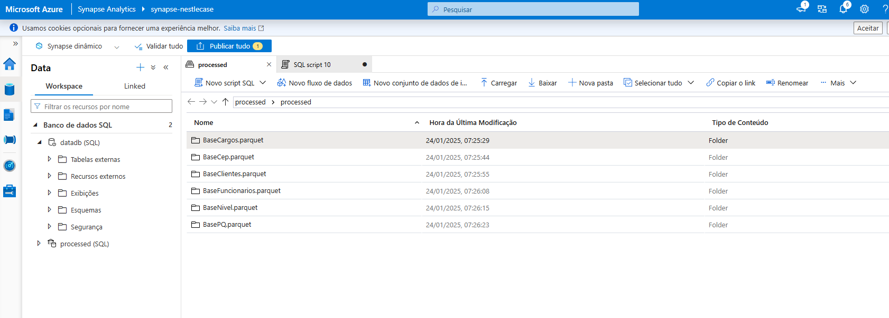
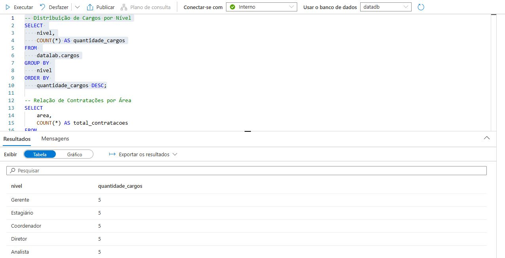
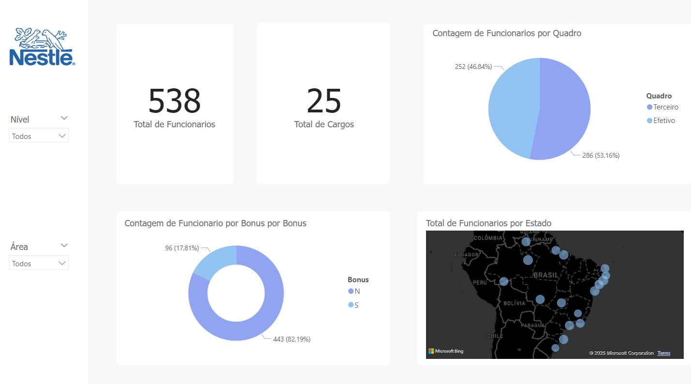

# Case Nestle
Este projeto tem como objetivo construir um pipeline de dados, envolvendo a ingestão, processamento e armazenamento de dados em um Data Lake utilizando a arquitetura do Azure.

# Desafio
Você recebeu 6 bases distintas: Cargos, CEP, Clientes, Funcionários, Nível e PQ.
Lembre que somos a maior empresa de bens de consumo do mundo e que no dia a dia
você irá trabalhar com bases muito maiores.

Must have: ETL e Documentação.

Escolha uma linguagem para demonstrar a lógica (python, pyspark, scala ou R)

Utilização de pelo menos 2 funções (Window, GroupBy, Union)

Lembre-se: Você é o responsável por tratar e fazer os relacionamentos dessas bases da melhor
maneira possível!

O entregável poderá ser uma apresentação ou os códigos comentados com a documentação (ou
ambos)

Nice to have:

5 insights relevantes dos datasets apresentados.

Utilização de uma Biblioteca/Framework extra (exemplo Pandas).

Lógica ou tratativa para dados sensíveis.

Data visualization.

# Arquitetura do Pipeline

# Tecnologias

**Ingestão:** Python  
**Processamento:** PySpark (Databricks)  
**Armazenamento:** Azure Data Lake Storage Gen 2  
**Formato de Dados:** CSV, Parquet  
**Cloud:** Azure  
**Armazenamento Analitico:** Azure Synapse Analytics  
**Visualização de Dados:** Power BI  
**Controle de Versionamento:** BitBucket  
**Visualização de Dados:** Power BI  
**Ferramentas:** Git, GitHub, Figma  

# Cenário

**Dados**  
Os dados para este projeto são extraídos de seis arquivos CSV contendo informações sobre funcionários de uma empresa fictícia. 

**Visão Geral do Pipeline de Dados**  
O pipeline inicia com a ingestão dos dados para o **Azure Data Lake Storage (ADLS) Gen 2** utilizando Python. Dentro do **Databricks**, os arquivos CSV são consumidos da camada **raw**. Após essa etapa, os dados passam por validações e transformações e são movidos para a camada **processed**. Com os dados processados, eles são consumidos pelo **Azure Synapse Analytics** para análises em larga escala. Por fim, são criados **dashboards interativos no Power BI** para visualização dos resultados e tomada de decisões. Além disso, a infraestrutura necessária para a execução do pipeline é provisionada e gerenciada utilizando **Terraform**, garantindo a criação e configuração automatizada de recursos no Azure.

Os passos do projeto são:

1. **Ingestão de Dados:**  
    A primeira etapa do pipeline é a ingestão dos dados para o **Azure Data Lake Storage (ADLS) Gen 2** utilizando **Python**. Os arquivos CSV são enviados para o Data Lake para processamento posterior.

    ---
    
2. **Leitura da Camada Row:**  
    Antes de começar fazer as transformações, os dados são lidos em formato CSV da camada raw.

    ---
    
3. **Tratamento de Dados (Validações e Transformações):**  
    Os dados passam por um processo de tratamento, que inclui validações e transformações necessárias, como limpeza de dados e ajustes conforme os requisitos de negócios.
    
    ---
    
4. **Armazenamento na Camada Processed:**  
    Após o tratamento, os dados processados são movidos para a **camada Processed**, onde ficam armazenados com qualidade e prontos para análises mais aprofundadas.
    
    ---
    
5. **Consumo pelo Azure Synapse Analytics:**  
    Os dados são consumidos pelo **Azure Synapse Analytics** para realizar consultas e análises em larga escala, aproveitando a escalabilidade da plataforma para gerar relatórios e insights rápidos.

    ---
    
6. **Geração de Insights:**
	Com os dados já limpos e ajustados, são gerados insights para analisa e exploração dos dados.

    ---
    
7. **Criação de Dashboards no Power BI:**  
    Por fim, **dashboards interativos** são criados no **Power BI**, oferecendo uma interface visual para a análise dos dados e apresentação dos insights gerados no pipeline.

    ---
    
    
8. **Infraestrutura como Código (Terraform)**:  
	A infraestrutura necessária para suportar o pipeline de dados é provisionada utilizando **Terraform**, garantindo consistência, automação e facilidade de replicação do ambiente. Isso inclui a configuração do **Azure Data Lake Storage (ADLS) Gen 2**, **Databricks**, **Synapse Analytics**, e outras dependências utilizadas no projeto.
